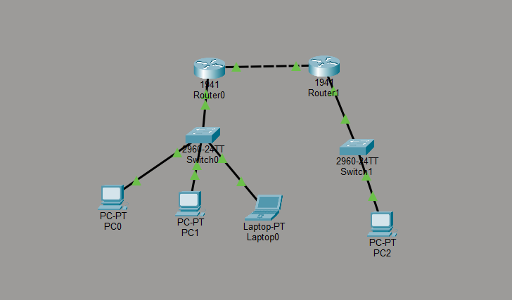
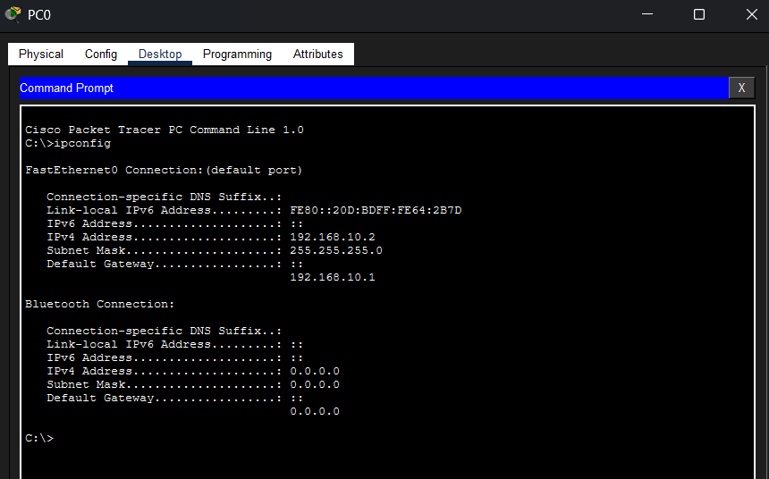
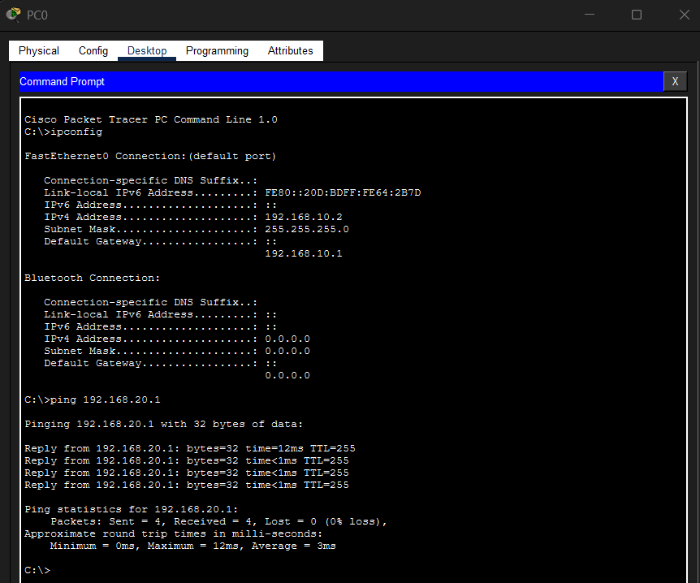
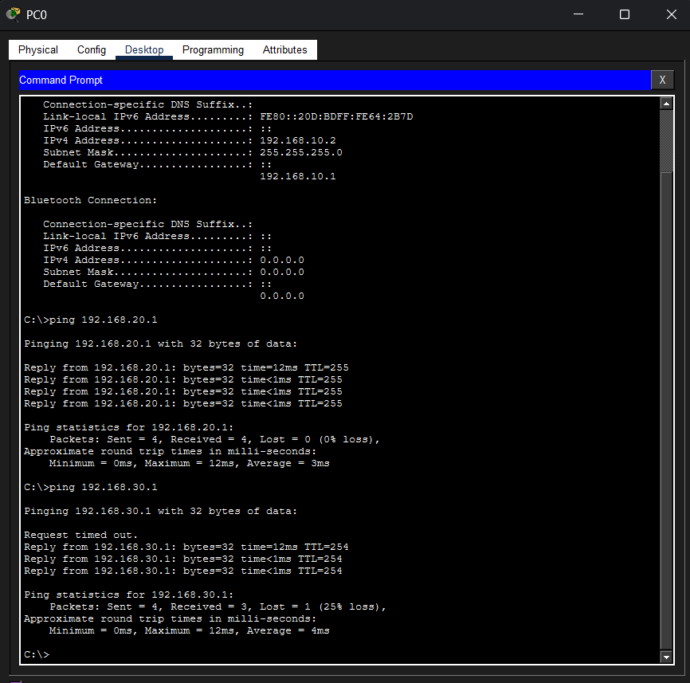

# 🏢 PoC: Infraestrutura de Redes Corporativas (Matriz e Filial)

Este laboratório prático (Proof of Concept) foi desenvolvido para consolidar os fundamentos teóricos de redes corporativas, simulando um ambiente escalável com comunicação isolada entre departamentos e roteamento externo. A compreensão física do tráfego de dados é uma base essencial para a minha transição e estudos em Cloud Computing e Análise de Dados.

## 🎯 Objetivo do Projeto
Criar do zero uma topologia de rede escalável conectando uma Matriz e uma Filial, garantindo que diferentes setores (Administração, TI e Vendas) tenham seus dados isolados e gerenciados de forma eficiente, mas se comunicando quando necessário sob regras de roteamento.

## 🛠️ Tecnologias e Protocolos Utilizados
* **Cisco Packet Tracer** (Ambiente de simulação)
* **VLANs (802.1Q)** para segmentação lógica dos departamentos.
* **Router-on-a-Stick** para roteamento Inter-VLAN.
* **DHCP Server** configurado nativamente nos roteadores para atribuição dinâmica de IPs.
* **Roteamento Estático (Link WAN)** conectando a Matriz à Filial.
* **Switchport Modes** (Access e Trunk).

## 📊 Galeria de Provas Técnicas e Troubleshooting

Abaixo, apresento as evidências técnicas da configuração do laboratório, validando a conectividade, a entrega de IPs e o roteamento dos pacotes.

  

<b>1. Visão Geral da Topologia de Rede (Matriz e Filial)</b> Os links ativos (verdes) indicam conectividade física estabelecida.

 

  

<b>2. Validação do DHCP Server</b> O PC0 (VLAN 10) recebendo dinamicamente o IP 192.168.10.2, Máscara e Gateway diretamente do Roteador da Matriz.

 

  

<b>3. Roteamento Inter-VLAN (Router-on-a-Stick)</b> Ping com sucesso do PC0 (VLAN 10) para o Laptop0 (VLAN 20), provando a comunicação entre redes logicamente isoladas.

 

  

<b>4. Roteamento Estático (Link WAN)</b> Comunicação fim a fim da Matriz (PC0) para a Filial (PC2). O TTL de 254 comprova o salto dos pacotes através dos dois roteadores e do link WAN.

